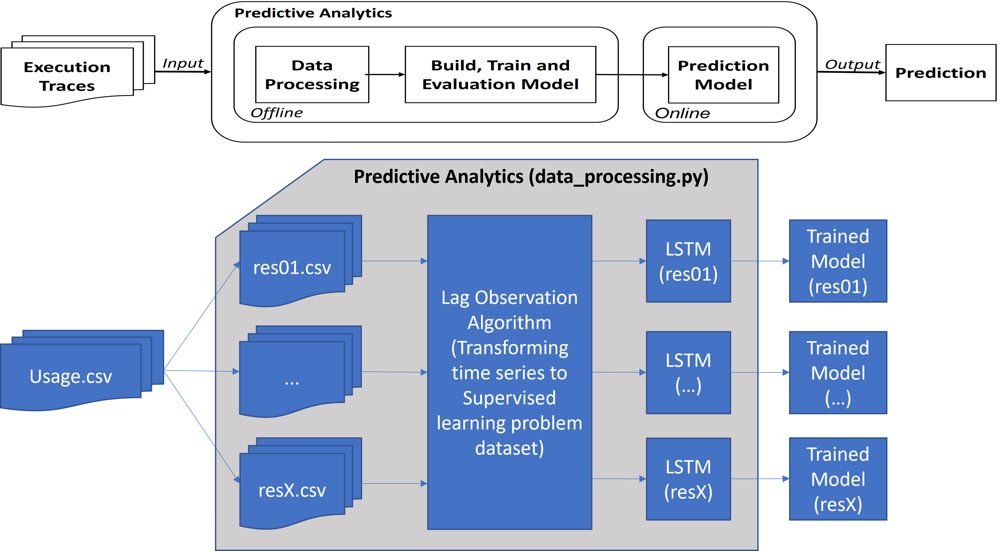

# DRAPA Project

## 1. Background of the project

**D**ynamic **R**esource **A**llocation for Executable BPMN Processes Using **P**redictive **A**nalytics (**DRAPA**)

In business processes, the resource allocation strategy affects the execution time of the process, and the cost of execution, due to the simultaneous execution of multiple instances and the sharing of resources between different tasks. Thus, resource allocation is crucial in business processes. 

This project proposes a generic dynamic resource allocation approach that adjusts the number of resource replicas to the resource usage of the runtime process.

## 2. Functions of the project

The project enables the modelling, deployment and monitoring of executable BPMN processes. In addition, it can perform real-time quantitative analysis of running processes, such as resource usage, instance execution time, and process execution costs. Then, based on the quantitative analysis, the amount of global resource replication in the process can be dynamically adjusted. Finally, in combination with the predictive analysis component, the allocation of resources can be adjusted in advance.

This project consists of four main components.
The executable BPMN **simulator**, the **quantitative analysis component**, the **dynamic resource allocation algorithm** and the **predictive analytics** component.

- **Simulator** 
  - Among these, the simulator can be defined by the user. 
  - Firstly, it creates and configures the BPMN processes that can be executed. 
  - Secondly, the workload of the process is defined and different execution instances are generated.
  - Thirdly, the tasks in the process can contain different characteristics, such as execution time, resource requirements, etc.
  - Fourthly, the processes are monitored at runtime.

- **Quantitative Analysis**

  - Firstly, a sliding window algorithm is used to extract different types of execution traces in the runtime processes.
  - Secondly, different properties of the process can be calculated in real time, such as the usage of different resources, the execution cost of the process, etc.
  - Thirdly, the execution traces of the changes in these properties are recorded.

- **Dynamic Resource Allocation**

  Based on the results of the quantitative analysis, the algorithm can adjust the global number of replicas of different resources.

- **Predictive Analytics**

  Based on the resource utilisation data recorded by the quantitative analysis, a predictive model of resource utilisation can be trained for each resource, enabling the number of replicas of the relevant resource to be adjusted in advance.

## 3. Overview of Tool Chain

## 4. Technology Stack

1. **Type of project**

- Maven >= 1.7

2. **Modeller and simulator for BPMN processes**

- Java >= 1.8

- Activiti == 6.0

- MySQL >= 8.0

- Ecplise IDE

- Activiti Designer plugin in Eclipse

3. **Predictive Analytics Component**

- Python 3.x
- Pandas, Matplotlib
- Tensorflow == 1.15

## 5. Installation & Configuration

Step 0: Adding  Activiti Designer  plugin in Eclipse
[Link: How to install Activiti Designer plugin in Eclipse/STS](https://websparrow.org/misc/how-to-install-activiti-designer-plugin-in-eclipse-sts)

Step 1:  git clone https://github.com/ahzm-code/DRAPA.git

Step 2:  In Eclipse, select File->Import-> Maven -> Exisiting Maven Projects

Step 3: Adding Maven dependencies

Step 4: Updating database information

Go to the "src/main/resources/" directory, then configure the database name, account and password (activiti.cfg.xml).

## 6. Structure of the project

## 7. Operating instructions

### 7.1. Creating a BPMN process

7.1.1 Go to folder "src/main/resources/bpmn", then right click and select 'new', then 'other', then select "Activiti Diagram" under the "Acitiviti" folder (see figure x).

7.1.2 Configure BPMN ID & BPMN name

Select the "Properties" section.

7.1.3 Adding attributes (time, resources, etc) to tasks 

Step 1: First select the "Task", then select the "Properties" section, next select "Form".

Step 2: Click on New to add a new attribute, or Edit to modify the selected attribute.

(The figure below shows adding execution time to a task.)

### 7.2. Deploying a BPMN process

Deploying a process

### 7.3.  Resources

Add the global resources required by the process and configure its parameters for the process after deployment.

### 7.4. Instances
Define workload, and generate process instances with variables

### 7.5. Executor
Execute the process

### 7.6. Predictive Analytics

